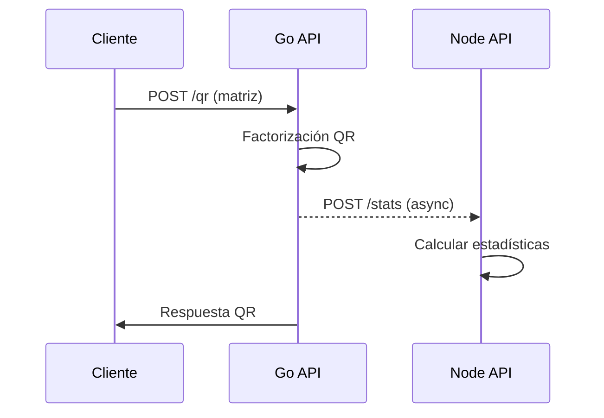

# Coding Challenge - Monorepo de APIs

Este proyecto implementa un monorepo con dos APIs que se comunican entre sí:

- **Go API**: Servicio que realiza factorización QR de matrices y rotación (opcional)
- **Node API**: Servicio que calcula estadísticas de matrices (max, min, avg, sum, diagonal)

## 🏗️ Arquitectura

```
coding-challenge/
├─ go-api/                # API Go con Fiber
│  ├─ main.go            # Servidor principal
│  ├─ main_test.go       # Tests unitarios
│  ├─ go.mod             # Dependencias Go
│  └─ Dockerfile         # Imagen Docker
├─ node-api/             # API Node con Express/TypeScript
│  ├─ src/
│  │  ├─ index.ts        # Servidor principal
│  │  ├─ routes/         # Rutas de la API
│  │  ├─ services/       # Lógica de negocio
│  │  └─ __tests__/      # Tests unitarios
│  ├─ package.json       # Dependencias Node
│  ├─ tsconfig.json      # Configuración TypeScript
│  ├─ jest.config.js     # Configuración tests
│  └─ Dockerfile         # Imagen Docker
├─ docker-compose.yml    # Orquestación de servicios
├─ README.md            # Este archivo
└─ .gitignore           # Archivos ignorados por Git
```

## 🚀 Inicio Rápido

### Con Docker (Recomendado)

```bash
# Clonar y entrar al directorio
cd coding-challenge

# Levantar todos los servicios
docker-compose up --build

# En otra terminal, verificar que funcionan
curl http://localhost:3001/health
curl http://localhost:3002/health
```

### Desarrollo Local

#### Go API (Puerto 3001)

```bash
cd go-api

# Instalar dependencias
go mod download

# Ejecutar
go run main.go

# Tests
go test -v
```

#### Node API (Puerto 3002)

```bash
cd node-api

# Instalar dependencias
npm install

# Desarrollo
npm run dev

# Compilar
npm run build

# Producción
npm start

# Tests
npm test
```

## 📡 API Endpoints

### Go API (Puerto 8080)

#### `GET /health`
Verifica el estado del servicio.

```bash
curl http://localhost:8080/health
```

**Respuesta:**
```json
{
  "ok": true,
  "service": "go-api",
  "status": "healthy"
}
```

#### `POST /qr` (Obligatorio)
Realiza factorización QR de una matriz.

```bash
curl -X POST http://localhost:8080/qr \
  -H "Content-Type: application/json" \
  -d '{
    "matrix": [
      [1, 2],
      [3, 4],
      [5, 6]
    ]
  }'
```

**Respuesta:**
```json
{
  "max": 0.894,
  "min": -0.632,
  "avg": 0.123,
  "sum": 2.456,
  "isDiagonalQ": false,
  "isDiagonalR": false,
  "processedAt": "2024-01-15T10:30:00.000Z"
}
```

#### `POST /rotate` (Opcional)
Rota una matriz 90 grados en sentido horario.

```bash
curl -X POST http://localhost:8080/rotate \
  -H "Content-Type: application/json" \
  -d '{
    "matrix": [
      [1, 2, 3],
      [4, 5, 6]
    ],
    "direction": "right"
  }'
```

**Respuesta:**
```json
{
  "rotated": [
    [4, 1],
    [5, 2],
    [6, 3]
  ]
}
```

### Node API (Puerto 3000)

#### `GET /health`
Verifica el estado del servicio.

```bash
curl http://localhost:3000/health
```

**Respuesta:**
```json
{
  "status": "ok",
  "service": "node-api",
  "timestamp": "2024-01-15T10:30:00.000Z",
  "uptime": 123.456
}
```

#### `POST /stats`
Calcula estadísticas de una matriz (max, min, avg, sum, diagonal).

```bash
curl -X POST http://localhost:3000/stats \
  -H "Content-Type: application/json" \
  -d '{
    "matrix": [
      [1, 2, 3],
      [4, 5, 6],
      [7, 8, 9]
    ],
    "source": "manual"
  }'
```

**Respuesta:**
```json
{
  "max": 9,
  "min": 1,
  "avg": 5,
  "sum": 45,
  "diagonal": [1, 5, 9],
  "mainDiagonalSum": 15,
  "source": "manual",
  "processedAt": "2024-01-15T10:30:00.000Z"
}
```

#### `GET /stats/history`
Obtiene el historial de estadísticas procesadas.

```bash
curl http://localhost:3000/stats/history
```

**Respuesta:**
```json
{
  "totalProcessed": 5,
  "lastProcessed": {
    "timestamp": "2024-01-15T10:30:00.000Z",
    "source": "qr",
    "matrixDimensions": "3x3",
    "stats": { ... }
  },
  "history": [ ... ]
}
```

## 🔄 Flujo de Comunicación

1. **Cliente** hace petición a **Go API** (`/qr` o `/rotate`)
2. **Go API** procesa la matriz (factorización QR o rotación)
3. **Go API** envía la matriz original a **Node API** (`/stats`) en background
4. **Node API** calcula y almacena estadísticas
5. **Go API** responde al cliente con el resultado



## 🐳 Docker

### Construcción Individual

```bash
# Go API
docker build -t go-api ./go-api

# Node API
docker build -t node-api ./node-api
```

### Ejecutar Servicios

```bash
# Con docker-compose (recomendado)
docker-compose up -d

# Verificar logs
docker-compose logs -f

# Parar servicios
docker-compose down
```

### Red Docker

Los servicios se comunican a través de la red `api-network`:
- `go-api` accesible internamente como `go-api:3001`
- `node-api` accesible internamente como `node-api:3002`

## 🧪 Testing

### Go API
```bash
cd go-api
go test -v
```

### Node API
```bash
cd node-api
npm test
```

### Tests de Integración (Manual)

```bash
# 1. Levantar servicios
docker-compose up -d

# 2. Test QR factorization (devuelve estadísticas de node-api)
curl -X POST http://localhost:8080/qr \
  -H "Content-Type: application/json" \
  -d '{"matrix": [[1,2],[3,4],[5,6]]}'

# 3. Verificar historial en node-api
curl http://localhost:3000/stats/history

# 4. Test rotación (no llama a node-api)
curl -X POST http://localhost:8080/rotate \
  -H "Content-Type: application/json" \
  -d '{"matrix": [[1,2,3],[4,5,6]], "direction": "right"}'

# 5. Test estadísticas directas en node-api
curl -X POST http://localhost:3000/stats \
  -H "Content-Type: application/json" \
  -d '{"matrix": [[1,2],[3,4]], "source": "manual"}'
```

## 💡 Ejemplos de Uso Avanzados

### Ejemplo QR con matriz rectangular (m×n, m≥n)
```bash
curl -X POST http://localhost:8080/qr \
  -H "Content-Type: application/json" \
  -d '{
    "matrix": [
      [1, 2],
      [3, 4],
      [5, 6]
    ]
  }'
```

### Ejemplo QR con matriz cuadrada
```bash
curl -X POST http://localhost:8080/qr \
  -H "Content-Type: application/json" \
  -d '{
    "matrix": [
      [1, 2, 3],
      [4, 5, 6],
      [7, 8, 9]
    ]
  }'
```

### Rotación a la izquierda (anti-horario)
```bash
curl -X POST http://localhost:8080/rotate \
  -H "Content-Type: application/json" \
  -d '{
    "matrix": [
      [1, 2],
      [3, 4]
    ],
    "direction": "left"
  }'
```

### Estadísticas directas (bypassing go-api)
```bash
curl -X POST http://localhost:3000/stats \
  -H "Content-Type: application/json" \
  -d '{
    "matrix": [
      [1, 0, 0],
      [0, 2, 0],
      [0, 0, 3]
    ],
    "source": "diagonal-test"
  }'
```

## 🛠️ Tecnologías Utilizadas

### Go API
- **Go 1.22+**: Lenguaje principal
- **Fiber v2**: Framework web
- **Gonum**: Biblioteca para cálculos matemáticos (QR)

### Node API  
- **Node.js 20+**: Runtime
- **Express**: Framework web
- **TypeScript**: Tipado estático
- **Jest**: Framework de testing

### DevOps
- **Docker**: Containerización
- **Docker Compose**: Orquestación
- **Alpine Linux**: Imágenes base ligeras

## 🐛 Troubleshooting

### Servicios no se comunican
```bash
# Verificar red Docker
docker network ls
docker network inspect coding-challenge_api-network

# Verificar DNS interno
docker exec -it coding-challenge_go-api_1 ping node-api
```

### Puerto ocupado
```bash
# Cambiar puertos en docker-compose.yml
# go-api: "3001:3001" -> "3011:3001"
# node-api: "3002:3002" -> "3012:3002"
```

### Logs de depuración
```bash
# Ver logs en tiempo real
docker-compose logs -f go-api
docker-compose logs -f node-api

# Ver logs específicos
docker logs coding-challenge_go-api_1
```

## 📈 Mejoras Futuras

- [ ] Autenticación JWT entre servicios
- [ ] Métricas con Prometheus
- [ ] Rate limiting
- [ ] Persistencia de estadísticas (Redis/PostgreSQL)
- [ ] Tests de integración automatizados
- [ ] CI/CD pipeline
- [ ] Documentación OpenAPI/Swagger

## 📄 Licencia

MIT License - Ver [LICENSE](LICENSE) para más detalles.

---

**Desarrollado como parte de un coding challenge técnico.**
