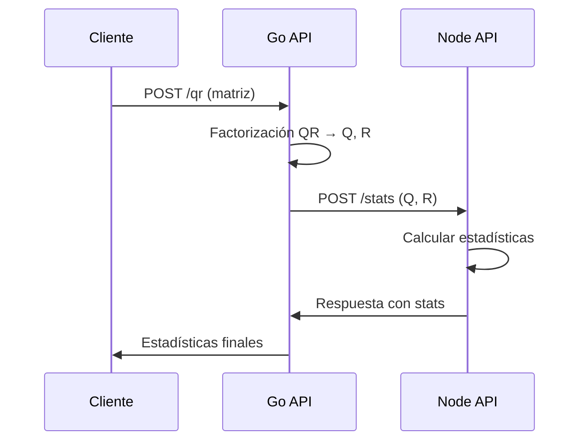

# Coding Challenge - Monorepo de APIs

Este proyecto implementa un monorepo con dos APIs que se comunican entre sí:

- **Go API**: Servicio que realiza factorización QR de matrices y rotación (opcional)
- **Node API**: Servicio que calcula estadísticas de matrices (max, min, avg, sum, diagonal)

## 🏗️ Arquitectura

```
coding-challenge/
├─ go-api/                # API Go con Fiber
│  ├─ main.go            # Servidor principal
│  ├─ main_test.go       # Tests unitarios
│  ├─ go.mod             # Dependencias Go
│  └─ Dockerfile         # Imagen Docker
├─ node-api/             # API Node con Express/TypeScript
│  ├─ src/
│  │  ├─ index.ts        # Servidor principal
│  │  ├─ routes/         # Rutas de la API
│  │  ├─ services/       # Lógica de negocio
│  │  └─ __tests__/      # Tests unitarios
│  ├─ package.json       # Dependencias Node
│  ├─ tsconfig.json      # Configuración TypeScript
│  ├─ jest.config.js     # Configuración tests
│  └─ Dockerfile         # Imagen Docker
├─ docker-compose.yml    # Orquestación de servicios
├─ README.md            # Este archivo
└─ .gitignore           # Archivos ignorados por Git
```

## 🚀 Inicio Rápido

### Con Docker (Recomendado)

```bash
# Clonar y entrar al directorio
cd coding-challenge

# Levantar todos los servicios
docker-compose up --build

# En otra terminal, verificar que funcionan
curl http://localhost:8080/health
curl http://localhost:3000/health
```

### Desarrollo Local

#### Go API (Puerto 8080)

```bash
cd go-api

# Instalar dependencias
go mod download

# Ejecutar
go run main.go

# Tests
go test -v
```

#### Node API (Puerto 3000)

```bash
cd node-api

# Instalar dependencias
npm install

# Desarrollo
npm run dev

# Compilar
npm run build

# Producción
npm start

# Tests
npm test
```

## 📡 API Endpoints

### Go API (Puerto 8080)

#### `GET /health`
Verifica el estado del servicio.

```bash
curl http://localhost:8080/health
```

**Respuesta:**
```json
{
  "ok": true
}
```

#### `POST /qr`
Realiza factorización QR de una matriz y obtiene estadísticas del node-api.

```bash
curl -X POST http://localhost:8080/qr \
  -H "Content-Type: application/json" \
  -d '{
    "matrix": [
      [1, 2],
      [3, 4],
      [5, 6]
    ]
  }'
```

**Respuesta (estadísticas de node-api):**
```json
{
  "max": 6.708,
  "min": -0.632,
  "avg": 0.876,
  "sum": 7.012,
  "isDiagonalQ": false,
  "isDiagonalR": true
}
```

#### `POST /rotate`
Rota una matriz 90 grados (no llama al node-api).

```bash
curl -X POST http://localhost:8080/rotate \
  -H "Content-Type: application/json" \
  -d '{
    "matrix": [
      [1, 2, 3],
      [4, 5, 6]
    ],
    "direction": "right"
  }'
```

**Respuesta:**
```json
{
  "rotated": [
    [4, 1],
    [5, 2],
    [6, 3]
  ]
}
```

### Node API (Puerto 3000)

#### `GET /health`
Verifica el estado del servicio y configuración JWT.

```bash
curl http://localhost:3000/health
```

**Respuesta:**
```json
{
  "ok": true,
  "jwt_enabled": false,
  "jwt_required": false
}
```

#### `POST /stats`
Calcula estadísticas de matrices Q y R (QR factorization).

```bash
curl -X POST http://localhost:3000/stats \
  -H "Content-Type: application/json" \
  -d '{
    "q": [
      [-0.169, -0.897],
      [-0.508, -0.276],
      [-0.845, 0.345]
    ],
    "r": [
      [-5.916, -7.437],
      [0, 0.828]
    ]
  }'
```

**Respuesta:**
```json
{
  "max": 0.345,
  "min": -7.437,
  "avg": -1.951,
  "sum": -15.606,
  "isDiagonalQ": false,
  "isDiagonalR": false
}
```

## 🔄 Flujo de Comunicación

### Endpoint `/qr` (con comunicación entre servicios)
1. **Cliente** hace petición a **Go API** (`POST /qr`)
2. **Go API** realiza factorización QR (matrices Q y R)
3. **Go API** envía Q y R a **Node API** (`POST /stats`)
4. **Node API** calcula estadísticas y devuelve resultado
5. **Go API** responde al cliente con las estadísticas

### Endpoint `/rotate` (sin comunicación)
1. **Cliente** hace petición a **Go API** (`POST /rotate`)
2. **Go API** rota la matriz
3. **Go API** responde directamente al cliente



## 🐳 Docker

### Construcción Individual

```bash
# Go API
docker build -t go-api ./go-api

# Node API
docker build -t node-api ./node-api
```

### Ejecutar Servicios

```bash
# Con docker-compose (recomendado)
docker-compose up -d

# Verificar logs
docker-compose logs -f

# Parar servicios
docker-compose down
```

### Red Docker

Los servicios se comunican a través de la red `api-network`:
- `go-api` accesible internamente como `go-api:8080`
- `node-api` accesible internamente como `node-api:3000`

## 🔒 Autenticación JWT (Opcional)

### **Configuración**
```bash
# Habilitar JWT en Node API
export JWT_REQUIRED=true
export JWT_SECRET=your-secret-key

# Token para Go API
export JWT_TOKEN=your-jwt-token
```

### **Generar Token de Prueba**
```bash
# Generar token con secret personalizado
cd node-api
node generate-jwt.js "my-secret" "2h"

# Output:
# Token: eyJhbGciOiJIUzI1NiIsInR5cCI6IkpXVCJ9...
# export JWT_TOKEN="eyJhbGciOiJIUzI1NiIsInR5cCI6IkpXVCJ9..."
```

### **Usar JWT**
```bash
# 1. Generar token
TOKEN=$(node node-api/generate-jwt.js "dev-secret" | grep -o 'eyJ[^"]*')

# 2. Configurar Node API
export JWT_REQUIRED=true
export JWT_SECRET=dev-secret

# 3. Configurar Go API  
export JWT_TOKEN=$TOKEN

# 4. Restart servicios
docker-compose up --build
```

### **Test con JWT**
```bash
# Con JWT
curl -H "Authorization: Bearer $TOKEN" \
  -X POST http://localhost:3000/stats \
  -H "Content-Type: application/json" \
  -d '{"q":[[1,0],[0,1]],"r":[[2,1],[0,3]]}'

# Sin JWT (fallará si JWT_REQUIRED=true)
curl -X POST http://localhost:3000/stats \
  -H "Content-Type: application/json" \
  -d '{"q":[[1,0],[0,1]],"r":[[2,1],[0,3]]}'
```

## 🧪 Testing

### Go API
```bash
cd go-api
go test -v ./...
```

### Node API
```bash
cd node-api
npm test
```

### Lista Completa de Testing

**Para prueba técnica - ejecutar TODOS los comandos:**

```bash
# Ver lista completa de comandos
./test-all.sh  # Linux/Mac
./test-all.ps1 # Windows PowerShell
```

### Tests de Integración (Manual)

```bash
# 1. Levantar servicios
docker-compose up -d

# 2. Test health checks
curl http://localhost:8080/health
curl http://localhost:3000/health

# 3. Test QR factorization (devuelve estadísticas de node-api)
curl -X POST http://localhost:8080/qr \
  -H "Content-Type: application/json" \
  -d '{"matrix": [[1,2],[3,4],[5,6]]}'

# 4. Test rotación (no llama a node-api)
curl -X POST http://localhost:8080/rotate \
  -H "Content-Type: application/json" \
  -d '{"matrix": [[1,2,3],[4,5,6]], "direction": "right"}'

# 5. Test estadísticas directas en node-api (QR format)
curl -X POST http://localhost:3000/stats \
  -H "Content-Type: application/json" \
  -d '{"q": [[1,0],[0,1]], "r": [[2,1],[0,3]]}'
```

## 💡 Ejemplos de Uso Avanzados

### Ejemplo QR con matriz rectangular (m×n, m≥n)
```bash
curl -X POST http://localhost:8080/qr \
  -H "Content-Type: application/json" \
  -d '{
    "matrix": [
      [1, 2],
      [3, 4],
      [5, 6]
    ]
  }'
```

### Ejemplo QR con matriz cuadrada
```bash
curl -X POST http://localhost:8080/qr \
  -H "Content-Type: application/json" \
  -d '{
    "matrix": [
      [1, 2, 3],
      [4, 5, 6],
      [7, 8, 9]
    ]
  }'
```

### Rotación a la izquierda (anti-horario)
```bash
curl -X POST http://localhost:8080/rotate \
  -H "Content-Type: application/json" \
  -d '{
    "matrix": [
      [1, 2],
      [3, 4]
    ],
    "direction": "left"
  }'
```

### Estadísticas directas con matrices diagonales
```bash
curl -X POST http://localhost:3000/stats \
  -H "Content-Type: application/json" \
  -d '{
    "q": [
      [1, 0, 0],
      [0, 1, 0],
      [0, 0, 1]
    ],
    "r": [
      [2, 0, 0],
      [0, 3, 0],
      [0, 0, 4]
    ]
  }'
```

**Respuesta esperada:**
```json
{
  "max": 4,
  "min": 0,
  "avg": 1.667,
  "sum": 15,
  "isDiagonalQ": true,
  "isDiagonalR": true
}
```

## 🛠️ Tecnologías Utilizadas

### Go API
- **Go 1.22+**: Lenguaje principal
- **Fiber v2**: Framework web
- **Gonum**: Biblioteca para cálculos matemáticos (QR)

### Node API  
- **Node.js 20+**: Runtime
- **Express**: Framework web
- **TypeScript**: Tipado estático
- **Jest**: Framework de testing

### DevOps
- **Docker**: Containerización
- **Docker Compose**: Orquestación
- **Alpine Linux**: Imágenes base ligeras

## 🐛 Troubleshooting

### Servicios no se comunican
```bash
# Verificar red Docker
docker network ls
docker network inspect coding-challenge_api-network

# Verificar DNS interno
docker exec -it coding-challenge_go-api_1 ping node-api
```

### Puerto ocupado
```bash
# Cambiar puertos en docker-compose.yml
# go-api: "8080:8080" -> "8081:8080"
# node-api: "3000:3000" -> "3001:3000"
```

### Logs de depuración
```bash
# Ver logs en tiempo real
docker-compose logs -f go-api
docker-compose logs -f node-api

# Ver logs específicos
docker logs coding-challenge_go-api_1
```

## 📈 Mejoras Futuras

- [x] Autenticación JWT entre servicios ✅
- [x] Tests unitarios ✅
- [x] CI/CD pipeline con Cloud Build ✅
- [ ] Métricas con Prometheus
- [ ] Rate limiting
- [ ] Persistencia de estadísticas (Redis/PostgreSQL)
- [ ] Documentación OpenAPI/Swagger
- [ ] Kubernetes deployment

## 📄 Licencia

MIT License - Ver [LICENSE](LICENSE) para más detalles.

## 📋 Resumen de Endpoints

### Go API (http://localhost:8080)
- `GET /health` - Health check
- `POST /qr` - Factorización QR + estadísticas automáticas
- `POST /rotate` - Rotación de matriz 90°

### Node API (http://localhost:3000)  
- `GET /health` - Health check + estado JWT
- `POST /stats` - Estadísticas de matrices Q y R

---

**Desarrollado como parte de un coding challenge técnico.**